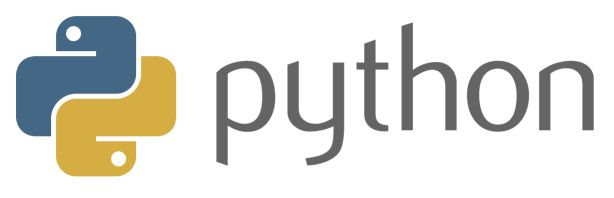

# APythonTour

## 目录

### [一、Python 简介](https://github.com/ShannonChenCHN/APythonTour/issues/13)
- 为什么要学 Python
- Python 的语言特性
- Python 的发展历史与版本
- Python 官方文档及相关学习资料

### [二、环境搭建](https://github.com/ShannonChenCHN/APythonTour/issues/2)
- 运行 Python 代码的几种方式
- 安装 Python3 解释器
  - 相关问题：如何升级 Mac 上的 Python 到最新
- 安装 IDE
- virtualenv

### 三、Python 基础语法
- [3.1 Hello World ](https://github.com/ShannonChenCHN/APythonTour/issues/7)
   - 输入输出
   - 注释
   - 缩进
   - 编码规范
      - [PEP 8 -- Style Guide for Python Code](https://www.python.org/dev/peps/pep-0008/)
- [3.2 数据类型和变量](https://github.com/ShannonChenCHN/APythonTour/issues/14)
- [3.3 条件和循环](https://github.com/ShannonChenCHN/APythonTour/issues/15)
- [3.4 函数](https://github.com/ShannonChenCHN/APythonTour/issues/3)
- [3.5 高级特性](https://github.com/ShannonChenCHN/APythonTour/issues/4)
- [3.6 函数式编程](https://github.com/ShannonChenCHN/APythonTour/issues/5)
- [3.7 模块](https://github.com/ShannonChenCHN/APythonTour/issues/6)
- [3.8 错误处理、调试和测试](https://github.com/ShannonChenCHN/APythonTour/issues/11)

### 四、Python 高级编程

- [4.1 面向对象编程](https://github.com/ShannonChenCHN/APythonTour/issues/8)
- [4.2 面向对象高级编程](https://github.com/ShannonChenCHN/APythonTour/issues/9)
- [4.3 IO 编程](https://github.com/ShannonChenCHN/APythonTour/issues/12)
- [4.4 并发编程](https://github.com/ShannonChenCHN/APythonTour/issues/10)
- [4.5 网络编程](https://github.com/ShannonChenCHN/APythonTour/issues/16)
- [4.6 数据库](https://github.com/ShannonChenCHN/APythonTour/issues/17)
- [4.7 异步 IO](https://github.com/ShannonChenCHN/APythonTour/issues/18)

### 五、内存管理

### 六、库
- [6.1 正则表达式](https://github.com/ShannonChenCHN/APythonTour/issues/19)
- 6.2 日期和时间
- 6.3 数字和数学计算
- 6.4 文件和目录访问
- [6.4 XML 和 HTML 解析](https://github.com/ShannonChenCHN/APythonTour/issues/21)
- 6.6 常用的第三方库
  - Pillow
  - requests
  - SQLAlchemy
  
### 六、Web 开发
- HTML、CSS 和 JavaScript
- WSGI 接口
- Web 框架的使用
  - Django
  - Flask
- 使用模板
- 实战

### 七、爬虫

### 八、机器学习
- 库
  - NumPy
  - Matplotlib
  - pandas
  - TensorFlow
  

  
### 九、Python 在 iOS 开发中的应用

## 参考
- [编程零基础应当如何开始学习 Python？](https://www.zhihu.com/question/20039623)
- [你是如何自学 Python 的？](https://www.zhihu.com/question/20702054)
- [如何系统地自学 Python？](https://www.zhihu.com/question/29138020)
- [学习Python — The Hitchhiker's Guide to Python - Python最佳实践指南！](http://pythonguidecn.readthedocs.io/zh/latest/intro/learning.html)
- [Python 的练手项目有哪些值得推荐？](https://www.zhihu.com/question/29372574)
- [Python教程 - 廖雪峰的官方网站](https://www.liaoxuefeng.com/wiki/0014316089557264a6b348958f449949df42a6d3a2e542c000)
- [Python 基础教程 - 菜鸟教程](http://www.runoob.com/python/python-tutorial.html)
- [简明 Python 教程](https://github.com/ShannonChenCHN/APythonTour/blob/master/byte-of-python-chinese-edition.epub)（A Byte of Python）
- [路人甲python总结](https://github.com/ShannonChenCHN/APythonTour/blob/master/%E8%B7%AF%E4%BA%BA%E7%94%B2python%E6%80%BB%E7%BB%93.docx)
- [Python 官方文档](https://docs.python.org/3/)
- 零基础学 Python 的目录（来自极客时间专栏）
- [Python进阶（中译本）](https://legacy.gitbook.com/book/eastlakeside/interpy-zh/details)
